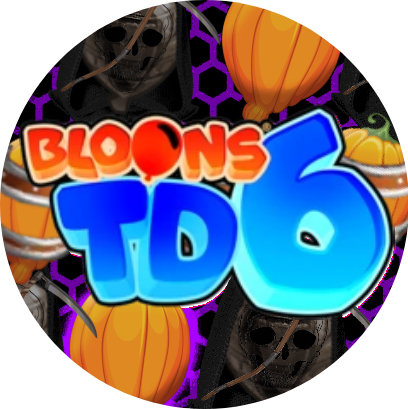

# HalloweenMod

<h1 align="center">Halloween Mod</h1>

Thid Mod Is The 2023 Halloween Special Adding A new tower with a fourth path (require path plus plus) on top of that a new gamemode wish u all the best halloween ever!

<h1 aling="left"></h1>

